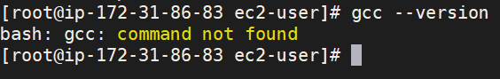
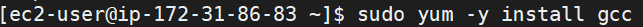
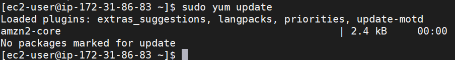
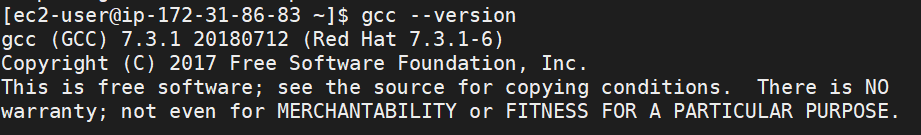
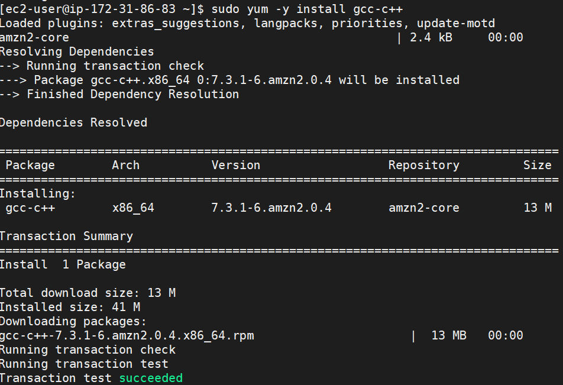
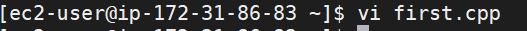
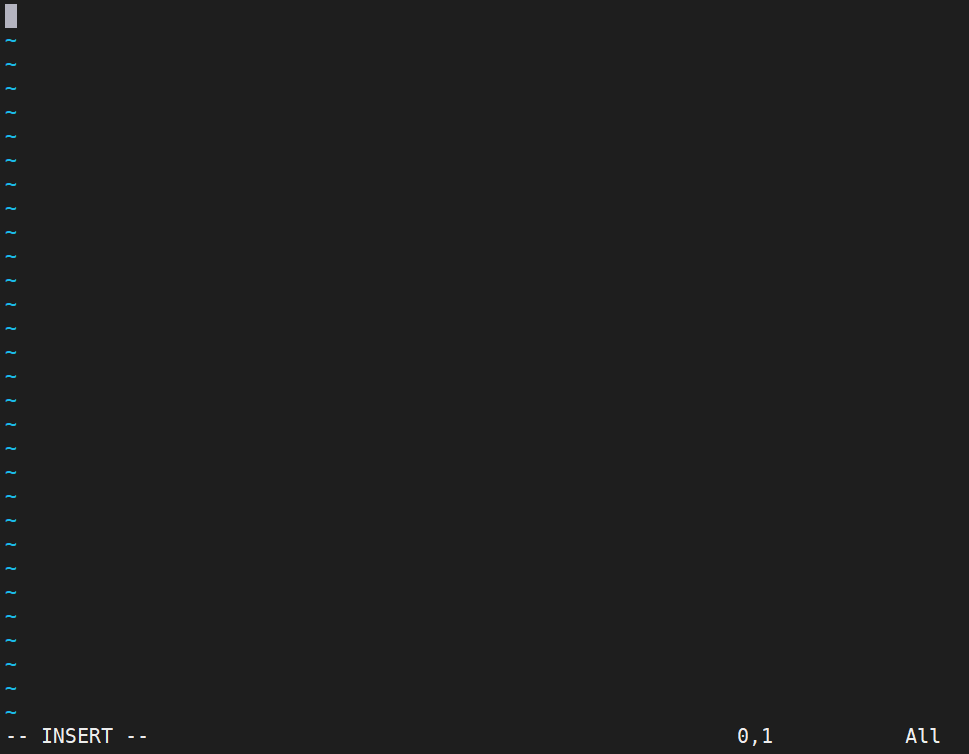
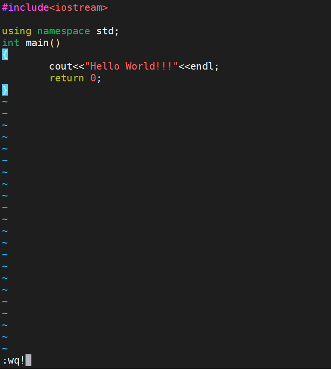
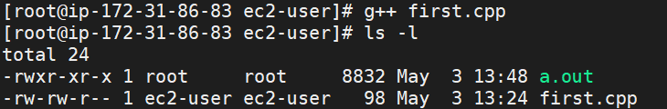
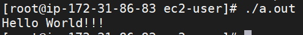

# How to execute C++ program on Ubuntu linux instance By using amazon cloud service?
***

First login to your amazone cloud account and create an instance of ubuntu linux OS.\
first check setup is istalled or not.\
To check try the command :\
`gcc --version`




If  it shows like above image then you have to install gcc in linux.


**Step-1 : Installation of GCC-C++**
***

command to install :\
`yum -y install gcc`



command to update :\
`sudo yum update`



Check the version again :\
`gcc --version`



As might be seen from the output, the GCC version distributed by red hat 7 is 7.3.1-6 which is not the latest version of GCC.

You may also want to install gcc-c++. It will automatically include the C++ library and compile files with extensions that indicate they are C source as C++, instead of as C.

Enter this command to Install GCC-C++ :\
`yum -y install gcc-c++`



*Now setup is ready to execute our first CPP program on our AWS LINUX Instance.*

**Step-2 : Implementation of CPP program**

Use any editor to type the code.\
For editor try command :\
e.g.\
`vi first.cpp`



type "i" to go in insert mode.



Write the code :\
e.g.\
#include\<iostream>\
using namespace std;
```
int main()\
{\
        cout<<"\n\nHello,\ World"<<endl;\
        return 0;\
} 
```
\
then press `esc` and then type `:wq!` to come out from editor.

**Step 3: Compilation of CPP Program file**

Use this command to Compile the CPP code and list the containt of current directory to see if the .out File is created or not.\
`g++ first.cpp` and then `ls -l` to see that *.out* file is created or not.



**Step 4: Running the Compile code of CPP**

Use the command to get the output :\
`./a.out`



*Congratulations!!!* You are done with the setup and running the program of cpp by using AWS Cloud Instance for Linux amazon ubuntu OS.
