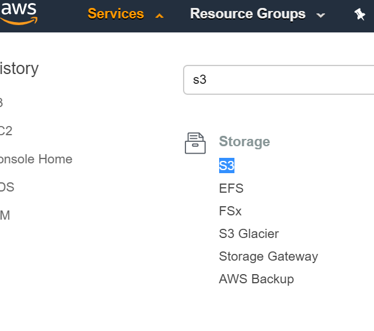
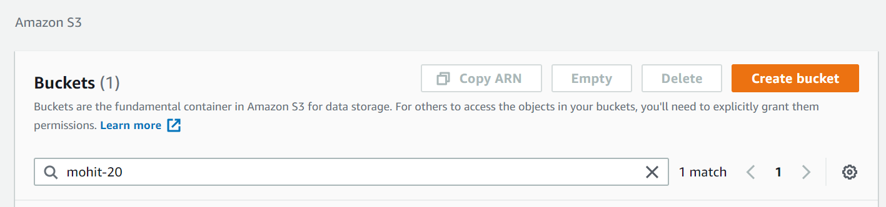
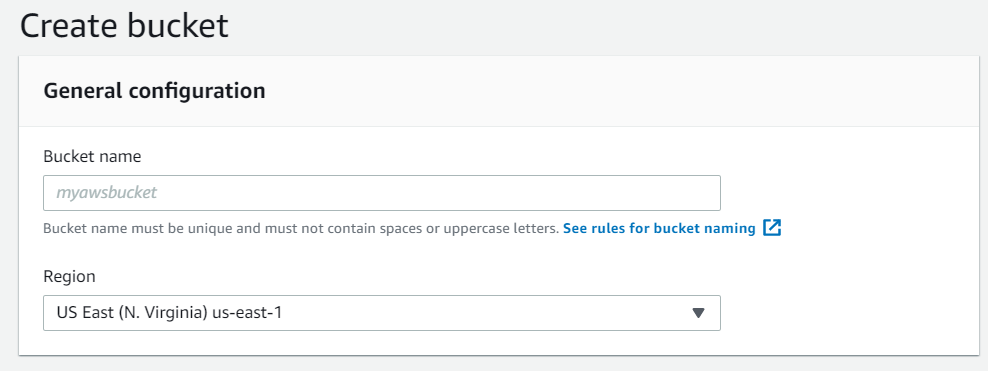
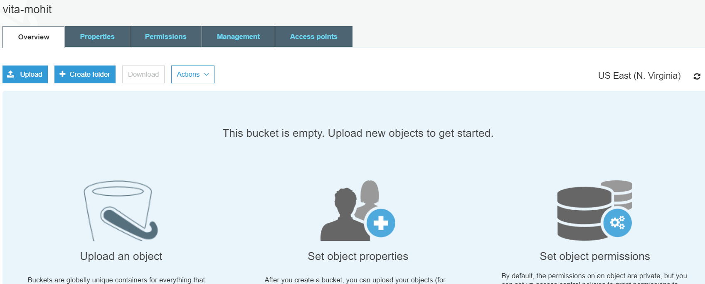
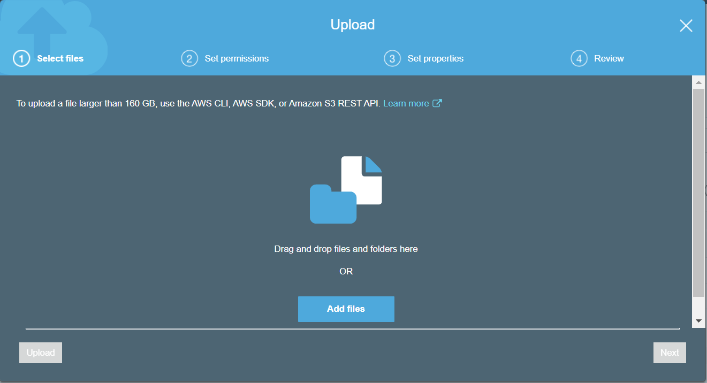
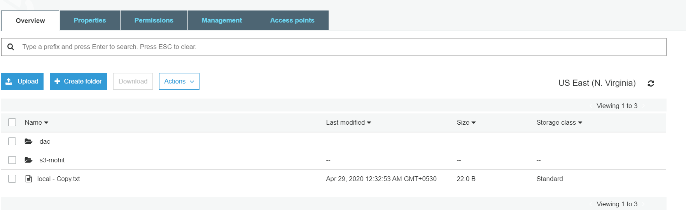

# S3 (Simple Storage Device)

S3 is storage web service,which is a storage engine which is used to store and retrieve any amount of data.\
 We have to create Bucket inside S3 to store the data. A bucket is a container (web folder) for objects (files) stored in Amazon S3. Buckets form the top-level namespace for Amazon S3, and bucket names are global.\
  This means that your bucket names must be unique across all AWS accounts We can also do web-hosting on s3 if the pages are static or dynamic pages are created react only.

## Steps to create bucket :

1. After login in AWS, Open AWS console\
  There is one dropdown option *"Servises"* click on that and type *s3*.

  

2. Choose to `create bucket` button

  

3. Enter bucket name and it must be unique across all existing buckets in Amazon S3.\
Keep region as it is.

4. Here is list of buckets you have created,  Now, click on bucket you have made.

5. For uploading the file in your created bucket, click on `upload` and drag the folder/file here or add the folder/file from your machine and upload it.

6. Now you can see your file/folder in your bucket.

## Benefits of amazone s3 :
- Low Cost and Easy to Use
- Secure
- Scalable
- Higher Performance
